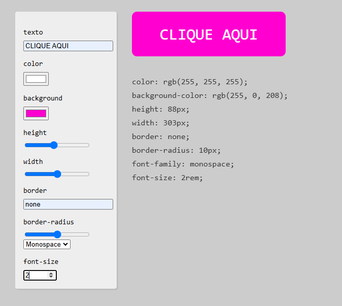

# README - Button Creator

<p><br>
Demonstração da tela
## Descrição

O **Button Creator** é uma projeto web que permite aos usuários criar botões personalizados de forma interativa. Ele apresenta uma interface simples e você poderá ajustar diversas propriedades do botão, como texto, cor, tamanho e estilo, visualizar as alterações em tempo real e o código css do botão.

## Tecnologias Utilizadas

- **HTML**: Estrutura da aplicação.
- **CSS**: Estilização da interface e dos botões.
- **JavaScript**: Interatividade e manipulação dinâmica dos estilos do botão.

## Funcionalidades

- **Texto do Botão**: Permite que o usuário defina o texto que aparecerá no botão.
- **Cor do Texto**: O usuário pode escolher a cor do texto do botão.
- **Cor de Fundo**: Permite a escolha da cor de fundo do botão.
- **Altura e Largura**: Ajuste dinâmico da altura e largura do botão usando barras range.
- **Borda**: Defina a borda do botão com um valor de texto.
- **Curvatura da Borda  (border-radius)**: Ajuste o arredondamento das bordas do botão.
- **Fonte**: Selecione a fonte para o texto do botão.
- **Tamanho da Fonte**: Ajuste o tamanho da fonte do texto do botão.

## Como Usar

1. **Clone o repositório**:
   ```bash
   git clone https://github.com/seu_usuario/button-creator.git
   cd button-creator
   ```

2. **Abra o arquivo `index.html` em um navegador**.

3. **Interaja com os controles**:
   - Preencha o campo de texto para definir o texto do botão.
   - Escolha as cores desejadas para o texto e o fundo.
   - Ajuste a altura e largura utilizando as barras.
   - Insira valores para a borda e a curvatura da borda.
   - Selecione a fonte e ajuste o tamanho, conforma desejado.

4. **Visualize o botão personalizado** e o código CSS correspondente na seção de resultado.